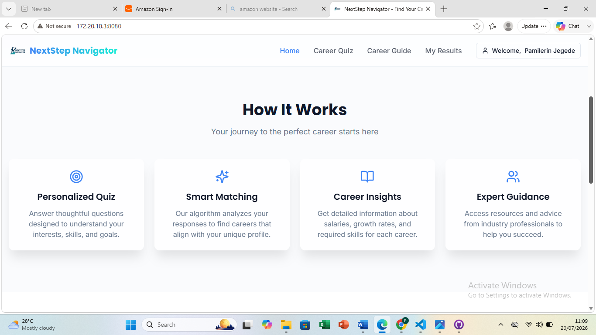
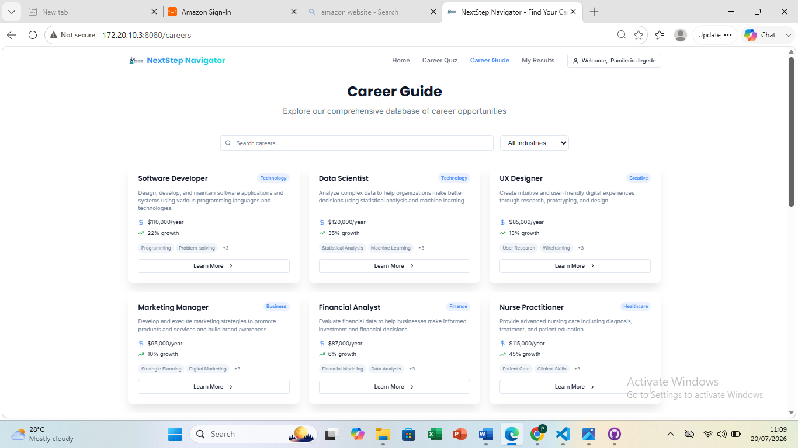

# Career Quest

Career Quest is a responsive career guidance web application built with React and TypeScript. It helps users explore career paths, discover learning opportunities, and navigate educational resources through an intuitive and interactive interface.

## Features

- Responsive design
- Interactive user interface
- Clean and modern layout
- Fast navigation
- Component-based architecture

## Technologies Used

- React
- TypeScript
- Vite
- CSS3
- HTML5

## Installation

git clone ...

npm install

npm run dev

## Screenshots

## Home Page

## Features

## Careers

## Future Improvements

- User authentication
- Backend integration
- Career recommendation engine

## Author

Pamilerin Jegede
